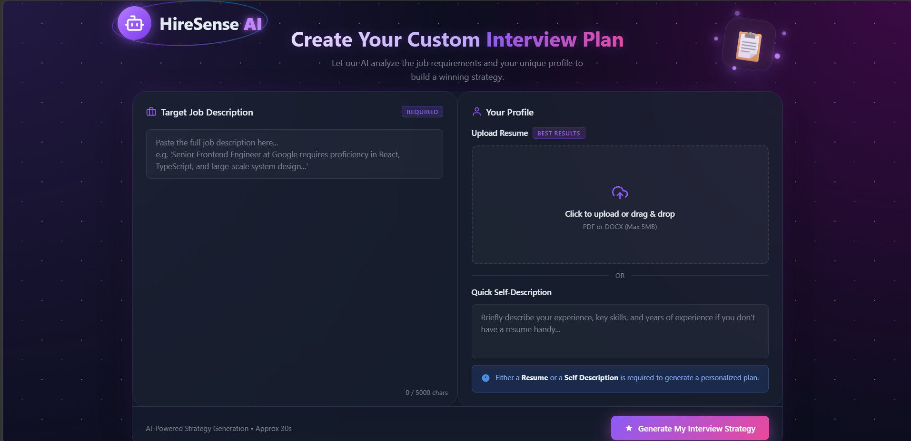
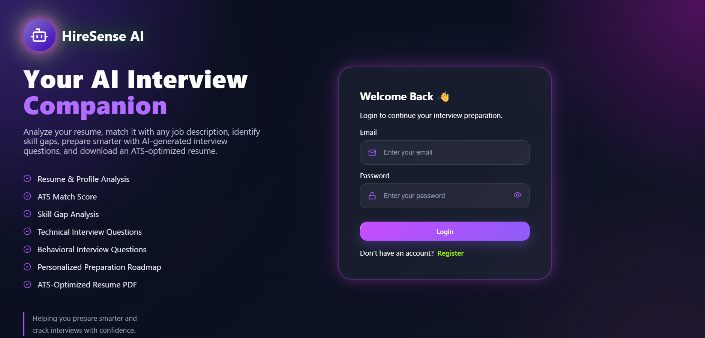
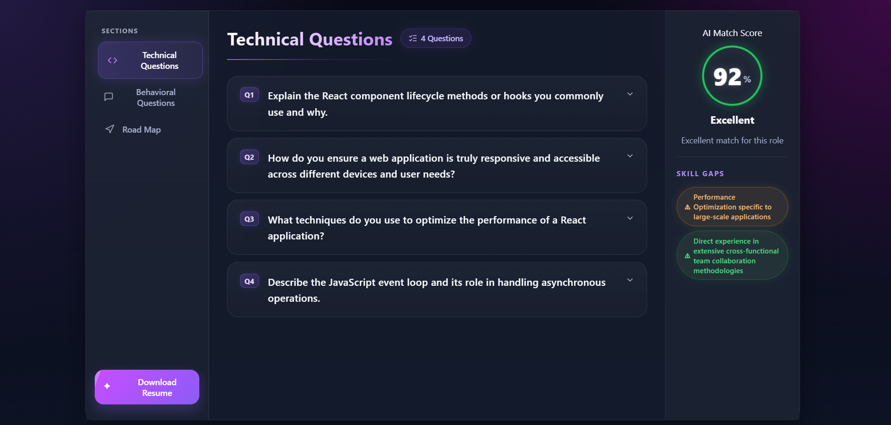
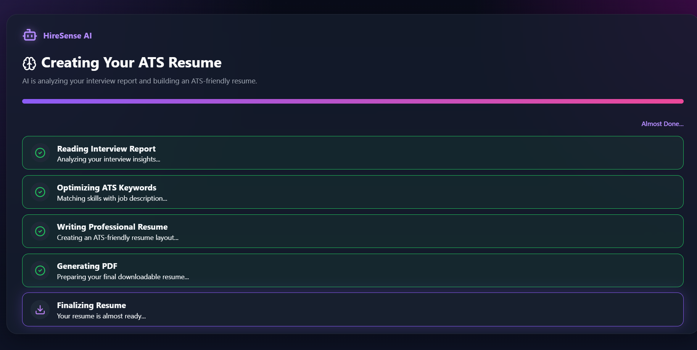

# 🚀 HireSense AI

> An AI-powered Interview Preparation & Resume Optimization Platform that analyzes resumes, evaluates job compatibility, generates interview questions, preparation roadmaps, and creates ATS-friendly resumes tailored to any job description.


---

---
# ✨ Features

## 📄 Resume Upload
- Upload your resume in PDF format.
- Extracts resume content automatically.
- Uses AI to understand candidate profile.

---

## 🎯 ATS Match Score
- Compares resume with Job Description.
- Generates an AI Match Score.
- Shows how well your profile matches the role.

---

## 💻 Technical Interview Questions
- AI generates role-specific technical questions.
- Includes:
  - Expected Answer
  - Interviewer's Intention
  - Best Approach

---

## 🧠 Behavioral Questions
Generates HR interview questions with:
- Purpose of the question
- Sample answers
- Answering strategy

---

## 📈 Skill Gap Analysis
Identifies missing skills and categorizes them into:

- 🟢 Low
- 🟡 Medium
- 🔴 High Priority

---

## 🛣️ Personalized Preparation Roadmap

Generates a day-wise preparation plan including:

- Topics to study
- Daily goals
- Practice tasks
- Interview preparation strategy

---

## 📄 AI Resume Generator

Generate an ATS-friendly resume based on:

- Existing Resume
- Self Description
- Job Description

Features:

- One-page ATS Resume
- Professional formatting
- PDF Download
- Tailored according to JD

---

# 📸 Screenshots
##  📝 Register Page

---
## 🏠 Home Page


---

## 📊 Interview Report



---
 
## 🤖  Resume Generator




---

# 🛠 Tech Stack

## Frontend

- React.js
- React Router
- SCSS
- Axios

---

## Backend

- Node.js
- Express.js
- MongoDB
- Mongoose

---

## AI

- Google Gemini 2.5 Flash API

---

## PDF Generation

- Puppeteer Core
- Sparticuz Chromium

---

## Authentication

- JWT Authentication
- HTTP Only Cookies

---

# 📂 Project Structure

```
HireSense/
│
├── Frontend/
│   ├── src/
│   ├── public/
│   └── package.json
│
├── Backend/
│   ├── src/
│   │   ├── controllers/
│   │   ├── routes/
│   │   ├── models/
│   │   ├── middleware/
│   │   ├── services/
│   │   └── utils/
│   │
│   ├── server.js
│   └── package.json
│
└── README.md
```

---


---

# 🚀 Deployment

Frontend

- Vercel

Backend

- Render

Database

- MongoDB Atlas

---

# API Flow

```
Resume Upload
        │
        ▼
Resume Parsing
        │
        ▼
Google Gemini API
        │
        ▼
Interview Report
        │
        ├── ATS Score
        ├── Technical Questions
        ├── Behavioral Questions
        ├── Skill Gaps
        └── Preparation Roadmap
```

Resume Generator Flow

```
Resume
      │
Self Description
      │
Job Description
      │
      ▼
Google Gemini
      │
HTML Resume
      │
Puppeteer
      │
PDF Download
```


---

# 📈 Learning Outcomes

Through this project I learned:

- Full Stack MERN Development
- JWT Authentication
- REST APIs
- MongoDB Integration
- Google Gemini API
- Resume Parsing
- Prompt Engineering
- Puppeteer PDF Generation
- Production Deployment
- Render & Vercel Deployment
- Cookie Authentication
- AI Response Structuring

---
# 👩‍💻 Author

**Divyanshi Upreti**

Computer Science Engineering Student


GitHub:
https://github.com/divyanshiupreti11

LinkedIn:
https://www.linkedin.com/in/divyanshi-upreti-4a757b322/

---


